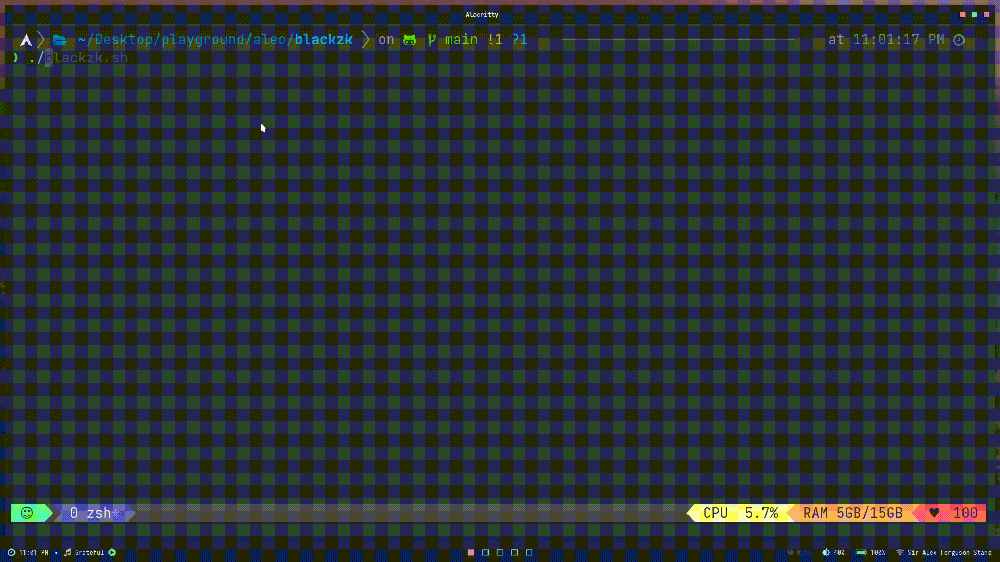

# BlackZK



<p align="center">A simple Zero Knowledge Blackjack app built on top of Aleo using SnarkVM.</p>

### Prerequisites

- [Rust](https://www.rust-lang.org/tools/install)
- [SnarkVM](https://developer.aleo.org/aleo/installation)

## Playing the game

1. Give permissions to the script

```bash
chmod +x ./blackzk.sh
```

2. Run the script

```bash
./blackzk.sh
```

---

### Build & Verify

```bash
snarkvm build
```

### Run

```bash
snarkvm run blackzk <aleo-address> <user-score>u8 <bet-amount>u8 <dealer-score>u8
```

Example: `snarkvm execute blackzk aleo1vwcvaf83rzsv29s02zk8zgp4k4x8uxkqd0rlqpl9qvynyzq3d58qysas9a 20u8 100u8 10u8`
